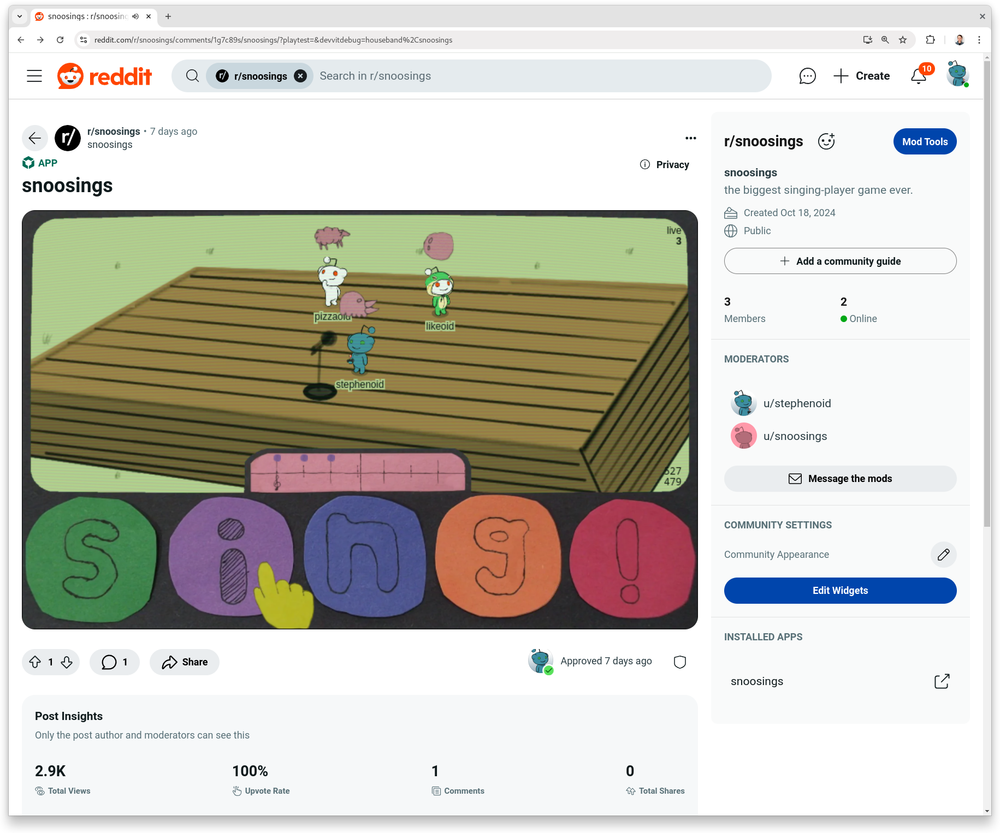

# 🌚 [snoosings](https://reddit.com/r/snoosings)

snoosings is a networked drum machine with a twist: if the internet drops, the last sent melodies will loop, but otherwise you have to keep playing the tones you want friends to hear, and the farther away you are from snoos, the quieter they sound. it's the biggest singing-player game ever.

## project structure

- src/app, src/main.tsx: devvit-specific code. the intent was to keep this part of the code as small as possible to minimize the devvitism learning curve and improve testability.
- src/shared: game code but may also be referenced by devvit.
- src/web-view: iframe and game code.
- src/test: test utils.

## features

- well typed realtime messaging. semi-optimized player and UTC audio synchronization. includes client version and per post filtering; outdated clients are notified to reload. demonstrates artificial peer messaging. anon and multi-session peer support.
- canvas rendering (naive nonproportional resizing).
- reddit player avatar (snoovatar) integration.
- well typed devvit to iframe messaging.
- offline esbuild development flow.
- iframe asset loading and initialization flow.
- Reddit Thing ID keying.
- multi-environment TypeScript configuration for worker (devvit), web view (iframe), and test (Node.js).
- distance based web audio.
- pointer and keyboard input.
